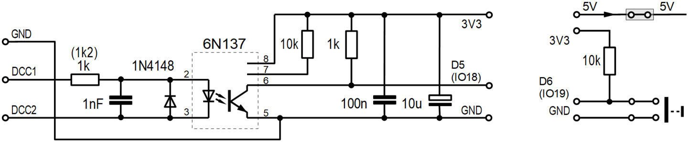

<a href="./README.md">==> English version</a>   
Letzte &Auml;nderung: 19.3.2024 <a name="up"></a>   
<h1>ESP32: Test des Selbstbau-Boards DCC_3V3</h1>   

# Ziel
Dieses Programm f&uuml;r einen ESP32 D1 mini dient zum Testen des selbst gebauten Boards DCC_3V3, das ein DCC Signal in ein 3,3Volt-Signal umwandelt.   
Empf&auml;ngt das Programm einen DCC-Befehl (an D5 = IO18) oder wird der Taster an D6 (IO19) bet&auml;tigt, so wird die eingebaute LED umgeschaltet und ein Z&auml;hler erh&ouml;ht.   
Weiters wird das Ereignis auf der seriellen Schnittstelle angezeigt.   

# Erforderliche Hardware
1. ESP32 D1 mini   
2. Selbstbau-Board DCC_3V3   
3. System zum Senden von DCC-Signalen   
   Zum Beispiel: Roco MultiMaus 10810 mit Roco Digitalverst&auml;rker 10764 und Netzteil 10850.   
4. Eventuell: Externe 5V-Versorgungsspannung   

   
_Bild 1: ESP32 D1 mini mit aufgesetztem DCC-3V3-Protoboard und DCC-Sender von Roco_ 

# Kurzanleitung
1. Programm `ESP32_01_DCC_receiver_V1.cpp` compilieren und auf den ESP32 D1 mini hochladen.   
2. Roco DCC-Sender an den DCC-Klemmen anschlie&szlig;en.   
3. Dr&uuml;cken des Tasters D6 bzw. Verbinden der beiden linken Pins am DCC_3V3_Protoboard.   
   * Die auf dem ESP32-Board eingebaute blaue LED sollte umschalten.   
   * In Visual Studio Code wird &uuml;ber die serielle Schnittstelle der Text 
"`#1 | Button pressed`" ausgegeben.   
4. Senden eines Weichensignals mit dem Roco DCC-Sender.   
   * Die auf dem ESP32-Board eingebaute blaue LED sollte umschalten.   
   * In Visual Studio Code wird &uuml;ber die serielle Schnittstelle mehrmals der Text 
"`#2 | onAccessoryPacket(): DCC Address 112, Value 0`" ausgegeben, da das DCC-Signals zur Sicherheit mehrnals gesendet wird.   
---   
5. Trennen der USB-Verbinung vom ESP32 und Anschlie&szlig;en der externen 5V-Versorgnug an die rechten beiden Pins (5V au&szlig;en).   
6. Wiederholung der Punkte 3. und 4. (diesmal ohne Ausgabe &uuml;ber die serielle Schnittstelle)   

# Details
## Entwicklungsumgebung
Das Programm wurde in Visual Studio Code und PlatformIO erstellt.   
Inhalt der Datei `platformio.ini`:   
```   
[env:wemos_d1_mini32]
platform = espressif32
board = wemos_d1_mini32
framework = arduino
monitor_speed = 115200
lib_deps =
  bblanchon/ArduinoJson@^6.21.1
  https://github.com/enginorama/DccAccessoryDecoder
```  

## Schaltung des DCC_3V3-Protoboards
Die Anpassung des DCC-Signals f&uuml;r einen Mikrocontroller erfolgt zB wie auf  
[https://dcc-ex.com/reference/tools/diagnostic-tools.html#gsc.tab=0](https://dcc-ex.com/reference/tools/diagnostic-tools.html#gsc.tab=0)
beschrieben.   

   
_Bild 2: Schaltung des DCC-3V3-Protoboards_   

Wird die Schaltung auf einem D1 mini Proto-Board aufgebaut, so kann der 10μF-Elko entfallen.   
Weiters ist auf dem D1 mini Proto-Board noch die Zuf&uuml;hrung f&uuml;r die 5V-Versorgung (inklusive Jumper) und der Anschluss f&uuml;r einen Taster untergebracht.   

## Aufbau des DCC_3V3-Protoboards
Das folgende Bild zeigt die Anordnung der Bauelemente auf dem Proto-Board.   Strichlierte Linien bedeuten, dass die Verbindung auf der Unterseite des Boards durchzuf&uuml;hren ist.   
   
_Bild 3: Anordnung der Bauteile auf dem DCC_3V3-Board_   

__*St&uuml;ckliste*__   
1x D1 mini Protoboard   
1x Optokoppler 6N137   
2x Widerstand 1kOhm   
2x Widerstand 10kOhm   
1x Kondensator 1nF (2,54mm Raster)   
1x Kondensator 100nF   
1x Diode 1N4148   
1x Fassung 8polig   
2x Buchsenleiste 8polig   
1x Buchsenleiste 2polig   
1x Buchsenleiste 4polig   
1x Stiftleiste 2polig   
1x Jumper   

   
_Bild 4: Einige Bauteile f&uuml;r das DCC_3V3-Board (ohne zweiten 10kOhm-Widerstand und Dr&auml;hte)_   

[Zum Seitenanfang](#up)
