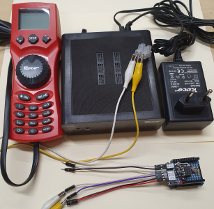
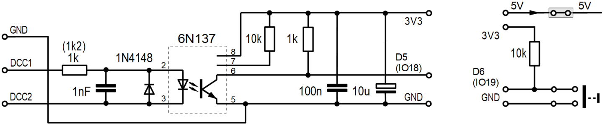
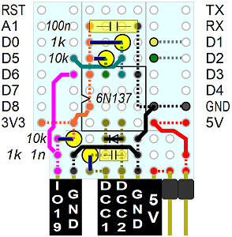
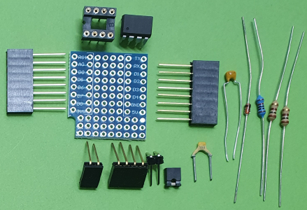

<a href="./LIESMICH.md">==> Deutsche Version</a>   
Last update: March 19, 2024 <a name="up"></a>   
<h1>ESP32: Test of the DCC_3V3 do-it-yourself board</h1>   

# Aim
This program for an ESP32 D1 mini is used to test the self-built DCC_3V3 board, which converts a DCC signal into a 3.3Volt signal.   
If the program receives a DCC command (at D5 = IO18) or if the button at D6 (IO19) is pressed, the built-in LED is switched over and a counter is generated.   
The event is also displayed on the serial interface.   

# Required hardware
1. ESP32 D1 mini   
2. do-it-yourself board DCC_3V3   
3. system for sending DCC signals   
   For example: Roco MultiMaus 10810 with Roco digital amplifier 10764 and power supply 10850.   
4. possibly: External 5V supply voltage   

   
Image 1: ESP32 D1 mini with attached DCC-3V3 protoboard and DCC transmitter from Roco_ 

# Quick guide
1. compile the program `ESP32_01_DCC_receiver_V1.cpp` and upload it to the ESP32 D1 mini.   
2. connect the Roco DCC transmitter to the DCC terminals.   
3. press button D6 or connect the two left pins on the DCC_3V3_Protoboard.   
   * The blue LED built into the ESP32 board should toggle.   
   * In Visual Studio Code, the text 
"`#1 | Button pressed`" is output via the serial interface.   
4. sending a turnout signal with the Roco DCC transmitter.   
   * The blue LED built into the ESP32 board should toggle.   
   * In Visual Studio Code, the serial interface repeatedly displays the text 
"`#2 | onAccessoryPacket(): DCC Address 112, Value 0`" is output several times, as the DCC signal is sent several times for safety reasons.   
---   
5. disconnect the USB connection from the ESP32 and connect the external 5V supply to the right two pins (5V outside).   
6. repeat points 3 and 4 (this time without output via the serial interface)   

# Details
## Development environment
The program was created in Visual Studio Code and PlatformIO.   
Contents of the file `platformio.ini`:   
```   
[env:wemos_d1_mini32]
platform = espressif32
board = wemos_d1_mini32
framework = arduino
monitor_speed = 115200
lib_deps =
  bblanchon/ArduinoJson@^6.21.1
  https://github.com/enginorama/DccAccessoryDecoder
```  

## Circuit of the DCC_3V3-Protoboard
The adaptation of the DCC signal for a microcontroller is carried out, for example, as shown on  
[https://dcc-ex.com/reference/tools/diagnostic-tools.html#gsc.tab=0](https://dcc-ex.com/reference/tools/diagnostic-tools.html#gsc.tab=0)
described.   

   
_Figure 2: Circuit of the DCC-3V3-Protoboard_   

If the circuit is built on a D1 mini proto board, the 10μF electrolytic capacitor can be omitted.   
In addition, the D1 mini Proto-Board also houses the supply for the 5V supply (including jumper) and the connection for a button.   

## Structure of the DCC_3V3 protoboard
The following picture shows the arrangement of the components on the Proto-Board.   Dashed lines indicate that the connection is to be made on the underside of the board.   
   
_Figure 3: Arrangement of the components on the DCC_3V3 board_   

__*Parts list*__   
1x D1 mini protoboard   
1x optocoupler 6N137   
2x 1kOhm resistor   
2x resistor 10kOhm   
1x capacitor 1nF (2,54mm pitch)   
1x capacitor 100nF   
1x diode 1N4148   
1x 8-pin socket   
2x socket strip 8-pole   
1x 2-pole socket strip   
1x 4-pin female connector   
1x pin header 2-pole   
1x jumper   

   
Image 4: Some components for the DCC_3V3 board (without second 10kOhm resistor and wires)_   

[Back to top of page](#up)
