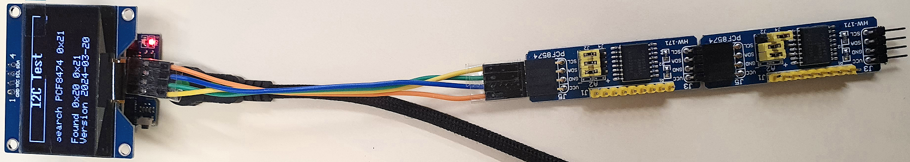
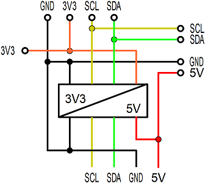
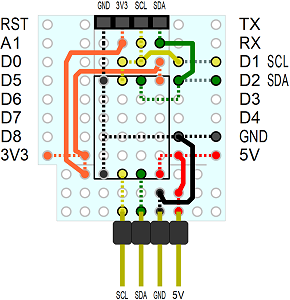

<a href="./README.md">==> English version</a>   
Letzte &Auml;nderung: 21.3.2024 <a name="up"></a>   
<h1>ESP32: Test des Selbstbau-Boards I2C_3V3_5V</h1>   

# Ziel
Dieses Programm f&uuml;r einen ESP32 D1 mini dient zum Testen des selbst gebauten Boards I2C_3V3_5V, das zwei Anschl&uuml;sse f&uuml;r I2C-Bus-Komponenten zur Verf&uuml;gung stellt. 
Die Anschl&uuml;sse unterscheiden sich durch die Pinbelegung und durch die H&ouml;he der Versorgungsspannung.   
Der Anschluss f&uuml;r OLED-Displays (1,54" oder 2,4") hat 3,3V als Versorgungsspannung, der Anschluss f&uuml;r PCF8574-Expander-Boards wird mit 5V betrieben, wobei die Datenleitungen f&uuml;r den Prozessor auf 3,3V umgewandelt werden.    

# Erforderliche Hardware
1. 1x ESP32 D1 mini   
2. 1x Selbstbau-Board I2C_3V3_5V   
3. 1x OLED-Display mit SSD1309 controller (zB 1,54" oder 2,4" Displays mit 128x64 Pixel Aufl&ouml;sung)   
4. 2x I²C-Expander-Board PCF8574   

   
_Bild 1: ESP32 D1 mini mit aufgesetztem I2C_3V3_5V-Protoboard und zwei PCF8574-Boards_ 

# Kurzanleitung
1. I2C_3V3_5V-Protoboard auf den ESP32 D1 mini aufstecken, OLED Display und zwei PCF8574 Boards (Adresse 0x290 und 0x21) anschlie&szlig;en.   
2. Programm `ESP32_02_I2C_test_pcf8574_oled154_V1.cpp` compilieren und auf den ESP32 D1 mini hochladen.   
3. Das Programm &uuml;berpr&uuml;ft, ob die PCF8574 Boards angeschlossen sind und zeigt das Ergebnis auf dem Display an.   

# Details
## Entwicklungsumgebung
Das Programm wurde in Visual Studio Code und PlatformIO erstellt.   
Inhalt der Datei `platformio.ini`:   
```   
[env:wemos_d1_mini32]
platform = espressif32
board = wemos_d1_mini32
framework = arduino
monitor_speed = 115200
lib_deps =
  bblanchon/ArduinoJson@^6.21.1
  https://github.com/enginorama/DccAccessoryDecoder
```   

## Schaltung des I2C_3V3_5V-Protoboards
Die Pegelwandlung 5V/3V3 erfolgt mit einem fertigen Board zB von [AliExpress](https://de.aliexpress.com/item/1005005575013390.html?spm=a2g0o.order_list.order_list_main.29.144f5c5flRN11a&gatewayAdapt=glo2deu).   
   
_Bild 2: Schaltung des I2C_3V3_5V-Protoboards_   

## Aufbau des DCC_3V3-Protoboards
Das folgende Bild zeigt die Anordnung der Bauelemente auf dem Proto-Board.   Strichlierte Linien bedeuten, dass die Verbindung auf der Unterseite des Boards durchzuf&uuml;hren ist.   
   
_Bild 3: Anordnung der Bauteile auf dem I2C_3V3_5V-Board_   

__*St&uuml;ckliste*__   
1x D1 mini Protoboard   
1x 5V 3V Step Up Dual Channel kompatibles i2c iic Logic Level Converter Modul   
2x Buchsenleiste 8polig   
1x Buchsenleiste 4polig   
2x Stiftleiste 4polig gerade (f&uuml;r Level Converter)   
1x Stiftleiste 4polig 90° abgewinkelt   
Diverse Dr&auml;hte   

## Software
Das Programm `ESP32_02_I2C_test_pcf8574_oled154_V1.cpp` zum Testen der I2C-Anschl&uuml;sse enth&auml;lt bereits einige zus&auml;tzliche Besonderheiten.   

### Testausgabe auf dem OLED-Display
Die Ausgabe auf das Display erfolgt mit der Bibliothek [u8g2](https://github.com/olikraus/u8g2). Aufbauend auf diese Software ist die Klasse `Screen154` f&uuml;r eine Textausgabe in Zeilen zust&auml;ndig, sodass man sich um die Pixeladdressierung nicht k&uuml;mmern muss. Es wird der Bildschirm `screen15` verwendet, der einen Titel und 5 weitere Textzeilen zur Verf&uuml;gung stellt.   
Jede mit der Funktion `showLine()` ausgegebene Zeile wird im Array `aScreenText[]` gespeichert, damit man in regelm&auml;&szlig;igen Abst&auml;nden den Bildschirm auffrischen kann, was die Lebensdauer der OLED-Anzeige erh&ouml;ht.   
Die zur Verwendung des Displays erforderlichen Code-Zeilen sehen folgenderma&szlig;en aus:   
```   
#define  SCREEN_TITLE   "I2C Test"
#define  SCREEN_LINE_MAX 6
#define  SCREEN_LINE_LEN 21
//       buffer for lines for screen update
String   aScreenText[SCREEN_LINE_MAX];
//       sign per line: 1=normal display, -1=inverted
int      aScreenSign[SCREEN_LINE_MAX]={1,1,1,1,1,1};
Screen154 screen_;
```   

### Verwaltung der PCF8574 Boards
Der Zugriff auf die I²C-Erweiterungsboards mit PCF8574 erfolgt mit Hilfe der Klasse `PCF8574`. F&uuml;r jedes verwendete Board wird ein Objekt angelegt, dem im Konstruktor die I²C-Adresse &uuml;bergeben wird. Alle Boards werden zu einem Array `pIOEx[]` zusammengefasst, sodass alle Boards mit Hilfe eines Index durchlaufen werden k&ouml;nnen.   
Der zur Definition erforderliche Code sieht folgenderma&szlig;en aus:   
```   
#define  IOEX_NUM       2              // number of IO expander
PCF8574  pcf8574_0(0x20);              // 8 digital OIs
PCF8574  pcf8574_1(0x21);              // 8 digital IN
PCF8574 *pIOEx[IOEX_NUM]={&pcf8574_0, &pcf8574_1}; // IO expander
```   

[Zum Seitenanfang](#up)
