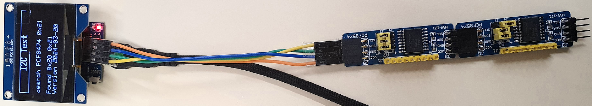
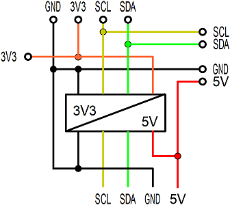
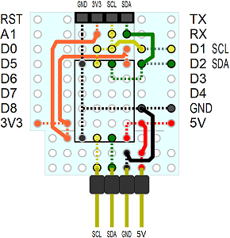

<a href="./LIESMICH.md">==> Deutsche Version</a>   
Last update: March 21, 2024 <a name="up"></a>   
<h1>ESP32: Test of the I2C_3V3_5V do-it-yourself board</h1>   

# Aim
This program for an ESP32 D1 mini is used to test the self-built board I2C_3V3_5V, which provides two connections for I2C bus components. 
The connections differ in terms of the pin assignment and the supply voltage level.   
The connection for OLED displays (1.54" or 2.4") has 3.3V as the supply voltage, the connection for PCF8574 expander boards is operated with 5V, whereby the data lines for the processor are converted to 3.3V.    

# Required hardware
1. 1x ESP32 D1 mini   
2. 1x DIY board I2C_3V3_5V   
3. 1x OLED display with SSD1309 controller (e.g. 1.54" or 2.4" displays with 128x64 pixel resolution)   
4. 2x I²C expander board PCF8574   

   
_Fig. 1: ESP32 D1 mini with attached I2C_3V3_5V protoboard and two PCF8574 boards_ 

# Quick guide
1. plug the I2C_3V3_5V protoboard onto the ESP32 D1 mini, connect the OLED display and two PCF8574 boards (address 0x290 and 0x21).   
2. compile the program `ESP32_02_I2C_test_pcf8574_oled154_V1.cpp` and upload it to the ESP32 D1 mini.   
3. the program checks whether the PCF8574 boards are connected and shows the result on the display.   

# Details
## Development environment
The program was created in Visual Studio Code and PlatformIO.   
Contents of the file `platformio.ini`:   
```   
[env:wemos_d1_mini32]
platform = espressif32
board = wemos_d1_mini32
framework = arduino
monitor_speed = 115200
lib_deps =
  bblanchon/ArduinoJson@^6.21.1
  https://github.com/enginorama/DccAccessoryDecoder
```   

## Circuit of the I2C_3V3_5V protoboard
The level conversion 5V/3V3 is done with a ready-made board e.g. from [AliExpress](https://de.aliexpress.com/item/1005005575013390.html?spm=a2g0o.order_list.order_list_main.29.144f5c5flRN11a&gatewayAdapt=glo2deu).   
   
_Fig. 2: Circuit of the I2C_3V3_5V-Protoboard_   

## Structure of the DCC_3V3-Protoboard
The following figure shows the arrangement of the components on the Proto-Board.   Dashed lines indicate that the connection must be made on the underside of the board.   
   
_Fig. 3: Arrangement of the components on the I2C_3V3_5V-Board_   

__*Parts list*__   
1x D1 mini Protoboard   
1x 5V 3V Step Up Dual Channel compatible i2c iic Logic Level Converter Module   
2x 8pin female header   
1x female connector 4pin   
2x pin header 4pin straight (for level converter)   
1x pin header 4-pin 90° angled   
Various wires   

## Software
The program `ESP32_02_I2C_test_pcf8574_oled154_V1.cpp` for testing the I2C connections already contains some additional features.   

### Test output on the OLED display
The output to the display is done with the library [u8g2](https://github.com/olikraus/u8g2). Based on this software, the class `Screen154` is responsible for text output in lines, so that there is no need to worry about pixel addressing. The screen `screen15` is used, which provides a title and 5 further lines of text.   
Each line output with the `showLine()` function is stored in the `aScreenText[]` array so that the screen can be refreshed at regular intervals, thus extending the life of the OLED display.   
The lines of code required to use the display are as follows:   
```   
#define  SCREEN_TITLE   "I2C Test"
#define  SCREEN_LINE_MAX 6
#define  SCREEN_LINE_LEN 21
//       buffer for lines for screen update
String   aScreenText[SCREEN_LINE_MAX];
//       sign per line: 1=normal display, -1=inverted
int      aScreenSign[SCREEN_LINE_MAX]={1,1,1,1,1,1};
Screen154 screen_;
```   

### Management of the PCF8574 boards
The I²C expansion boards with PCF8574 are accessed using the class `PCF8574`. An object is created for each board used, which is given the I²C address in the constructor. All boards are combined into an array `pIOEx[]` so that all boards can be run through with the help of an index.   
The code required for the definition is as follows:   
```   
#define  IOEX_NUM       2              // number of IO expander
PCF8574  pcf8574_0(0x20);              // 8 digital OIs
PCF8574  pcf8574_1(0x21);              // 8 digital IN
PCF8574 *pIOEx[IOEX_NUM]={&pcf8574_0, &pcf8574_1}; // IO expander
```   

[Back to top of page](#up)
