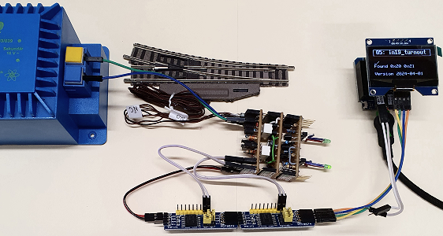

<a href="./README.md">==> English version</a>   
Letzte &Auml;nderung: 1.4.2024    
<h1>ESP32: Test der 5V-Ansteuerung einer Modelleisenbahn-Weiche</h1>   

# Ziel
Dieses Programm f&uuml;r einen ESP32 dient zum Testen der Ansteuerung einer Modellbahn-Weiche mit Endabschaltung. Der Befehl zum Umschalten der Weiche wird durch einen am ESP32 angeschlossenen Taster erteilt.   
Das Schalten des Weichenantriebs erfolgt &uuml;ber zwei Pins eines I2C-Expanders PCF8574 und eine Relais-Schaltung (Selbstbau-Schaltung U5_W).   
Die R&uuml;ckmeldung erfolgt &uuml;ber zwei Pins eines zweiten I2C-Expanders PCF8574 und wird auf einem 1,54"-OLED-Display angezeigt.   

# Erforderliche Hardware
## Elektronische Bauteile   
1. ESP32 D1 mini   
2. 1x Selbstbau-Board I2C_3V3_5V   
3. 1x OLED-Display mit SSD1309 controller (zB 1,54" oder 2,4" Displays mit 128x64 Pixel Aufl&ouml;sung) am Selbstbau-Board I2C_3V3_5V   
4. 2x I²C-Expander-Boards PCF8574 mit den (7-Bit-)Adressen 0x20 und 0x21 am Selbstbau-Board I2C_3V3_5V   
5. Ein Taster am Pin D6 (IO19) mit Pullup-Widerstand (zB 10 kOhm) nach 3,3V (Ein Anschluss daf&uuml;r ist zB auf dem Selbstbau-Board DCC_3V3 vorhanden)   

## Elektrische Bauteile
1. Eine Weiche mit Endabschaltung   
2. Ein Trafo mit 16V Wechselspannung (V+, V-)   
3. Die Selbstbau U5_W-Platinen zur Ansteuerung der Weiche mit 5V   

## Kabel
1. 1x Flachbandkabel Stecker-Buchse 2polig: PCF8574-0x20 Pin 0 und 1 mit U5_W-Platinen Pin WSA und WSB verbinden
2. 1x Flachbandkabel Stecker-Buchse 2polig: PCF8574-0x21 Pin 0 und 1 mit U5_W-Platinen Pin WRA und WRB verbinden
3. 1x Flachbandkabel Stecker-Buchse 2polig f&uuml;r die Stromversorgung vom PCF8574-Ausgang zu den U5_W-Platinen
4. 1x Flachbandkabel Stecker-Stecker 2polig f&uuml;r den Anschluss der 18V-Wechselspannung an den U5_W-Platinen
4. 1x Flachbandkabel Stecker-Stecker als Taster an IO19 gegen Masse

   
_Bild 1: Testanordnung 5V_W-Weichensteuerung_ 

# Kurzanleitung
1. Die Weiche an die U5_W-Platinen anschlie&szlig;en (Leitungen WA, W0, WB).   
2. Die U5_W-Platinen mit den I²C-Expander-Boards PCF8574 verbinden (Leitungen WSA, WSB, WRA, WRB).   
3. An die U5_W-Platinen die Versorgungsspannung anschlie&szlig;en (5V, 0V von den Expander-Boards).   
4. An die U5_W-Platinen die Schaltspannung anschlie&szlig;en (V+ und V-).   
1. Programm `ESP32_05_in19_turnout_V1.cpp` compilieren und auf den ESP32 D1 mini hochladen.   

Dr&uuml;ckt man den Taster an IO19 (bzw. verbindet man IO19 kurz mit GND), so schaltet die Weiche um und ihr Zustand wird am Display angezeigt (gerade `__` oder Abzweigung `_/`).   
Schaltet man die Weiche per Hand, so wird diese &Auml;nderung ebenfalls am Display angezeigt.    

# Verdrahtung
Die Verdrahtung erfolgt nach folgendem Schema:
   
_Bild 2: Verdrahtung der 5V_W-Weichensteuerung_ 

# Programmdetails

## Entwicklungsumgebung
Das Programm wurde in Visual Studio Code und PlatformIO erstellt.   

## Anzeige auf serieller Schnittstelle
Ist der Debug-Modus eingeschaltet (`#define DEBUG_05 true`) wird im seriellen Monitor der Zustand jedes States angezeigt:   
* state Nummer   
* Zeitdauer f&uuml;r die Arbeiten in diesem State    
Zus&auml;tzlich zu diesen Informationen werden weitere Meldungen ausgeben, falls sie auftreten:   
* Tastendruck ("Button pressed!")   
* Schaltzustand der Weiche ("Turnout _/")   
* Abschalten der Weichenansteuerung ("Turnout off!")   

## Statemachine
Wird die maximale Zeit f&uuml;r einen State &uuml;berschritten, so wird diese Zeit in den nachfolgenden States aufgeholt (aber nicht mehr als maximal 100 kurze States).

## OLED-Display
Die Ausgabe auf das Display erfolgt mit der Bibliothek [u8g2](https://github.com/olikraus/u8g2). Aufbauend auf diese Software ist die Klasse `Screen154` f&uuml;r eine Textausgabe in Zeilen zust&auml;ndig, sodass man sich um die Pixeladdressierung nicht k&uuml;mmern muss. Es wird der Bildschirm `screen15` verwendet, der einen Titel und 5 weitere Textzeilen zur Verf&uuml;gung stellt.   

## PCF8574 Boards
Der Zugriff auf die I²C-Erweiterungsboards mit PCF8574 erfolgt mit Hilfe der Klasse `PCF8574`. F&uuml;r jedes verwendete Board wird ein Objekt angelegt, dem im Konstruktor die I²C-Adresse &uuml;bergeben wird.   

[Zum Seitenanfang](#up)