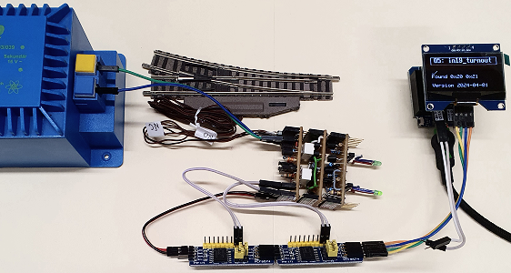
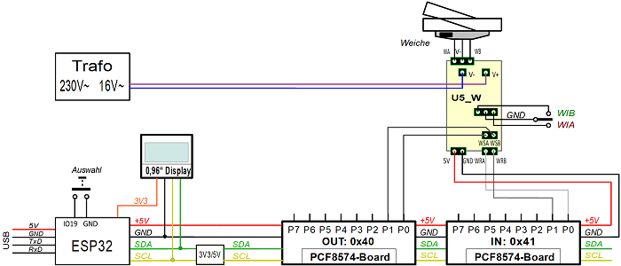

<a href="./LIESMICH.md">==> Deutsche Version</a>   
Last update: April 01, 2024    
<h1>ESP32: Test of the 5V control of a model railroad turnout</h1>   

# Target
This program for an ESP32 is used to test the control of a model railroad turnout with limit switching. The command to switch the turnout is given by a pushbutton connected to the ESP32.   
The turnout drive is switched via two pins of an I2C expander PCF8574 and a relay circuit (DIY circuit U5_W).   
Feedback is provided via two pins of a second PCF8574 I2C expander and is shown on a 1.54" OLED display.   

# Required hardware
## Electronic components   
1. ESP32 D1 mini   
2. 1x DIY board I2C_3V3_5V   
3. 1x OLED display with SSD1309 controller (e.g. 1.54" or 2.4" displays with 128x64 pixel resolution) on the DIY board I2C_3V3_5V   
4. 2x I²C expander boards PCF8574 with the (7-bit) addresses 0x20 and 0x21 on the DIY board I2C_3V3_5V   
5. a button on pin D6 (IO19) with pull-up resistor (e.g. 10 kOhm) to 3.3V (a connection for this is available on the DCC_3V3 DIY board, for example)   

## Electrical components
1. a turnout with limit switch   
2. a transformer with 16V alternating voltage (V+, V-)   
3. the self-made U5_W boards for controlling the turnout with 5V   

## Cable
1. 1x ribbon cable 2-pin plug/socket: PCF8574-0x20 Connect pin 0 and 1 to U5_W boards pin WSA and WSB
2. 1x ribbon cable 2-pin plug/socket: PCF8574-0x21 Connect pin 0 and 1 to U5_W boards pin WRA and WRB
3. 1x ribbon cable, 2-pin male/female connector for the power supply from the PCF8574 output to the U5_W boards
4. 1x ribbon cable male-male 2-pin for connecting the 18V AC voltage to the U5_W boards
4. 1x ribbon cable plug-plug as push-button on IO19 to ground

   
_Figure 1: Test arrangement 5V_W switch control_ 

# Quick guide
1. connect the backer to the U5_W boards (lines WA, W0, WB).   
2. connect the U5_W boards to the PCF8574 I²C expander boards (lines WSA, WSB, WRA, WRB).   
3. connect the supply voltage to the U5_W boards (5V, 0V from the expander boards).   
4. connect the switching voltage to the U5_W boards (V+ and V-).   
1. compile the program `ESP32_05_in19_turnout_V1.cpp` and upload it to the ESP32 D1 mini.   

If you press the button on IO19 (or briefly connect IO19 to GND), the turnout switches and its status is shown on the display (straight `__` or turnout `_/`).   
If the points are switched manually, this change is also shown on the display.    

# Wiring
The wiring is done according to the following scheme:
   
_Figure 2: Wiring of the 5V_W turnout control_ 

# Program details

## Development environment
The program was created in Visual Studio Code and PlatformIO.   

## Display on serial interface
If the debug mode is switched on (`#define DEBUG_05 true`), the status of each state is displayed in the serial monitor:   
* state number   
* Time duration for the work in this state    
In addition to this information, further messages are output if they occur:   
* Button pressed ("Button pressed!")   
* Switching status of the turnout ("Turnout _/")   
* Switching off the turnout control ("Turnout off!")   

## Statemachine
If the maximum time for a state is exceeded, this time is made up in the subsequent states (but not more than a maximum of 100 short states).

## OLED display
The output to the display is done with the library [u8g2](https://github.com/olikraus/u8g2). Based on this software, the class `Screen154` is responsible for text output in lines, so that there is no need to worry about pixel addressing. The screen `screen15` is used, which provides a title and 5 further lines of text.   

## PCF8574 Boards
The I²C expansion boards with PCF8574 are accessed using the class `PCF8574`. An object is created for each board used, to which the I²C address is passed in the constructor.   

[To the top of the page](#up)