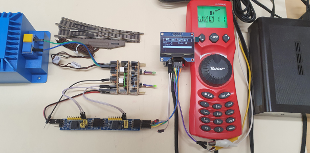
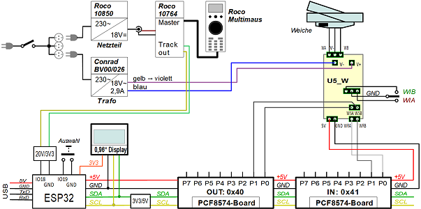

<a href="./LIESMICH.md">==> Deutsche Version</a>   
Last update: April 02, 2024 <a name="up"></a>   
<h1>ESP32: Control of a model railroad turnout via DCC or MQTT</h1>   

# Aim
This program for an ESP32 is used to test the control of a model railroad turnout with limit switching via DCC or MQTT.   
The turnout drive is switched via two pins of an I2C expander PCF8574 and a relay circuit (self-made circuit U5_W).   
The feedback signal is sent via two pins of a second I2C expander PCF8574 and is shown on a 1.54" OLED display.   
A button on pin D6 (IO19) can be used to cancel this step during the search for the WLAN and work without MQTT (e.g. if the WLAN is not accessible).   
If you press the button for one second while the program is running, a reset is triggered. This can be used, for example, to activate the WLAN while the program is running.   
All project-specific data, such as WLAN access, MQTT commands and hardware properties, are stored in a configuration file `dcc_config.h`.   

# Required hardware
## Electronic components   
1. ESP32 D1 mini   
2. 1x DIY board I2C_3V3_5V   
3. 1x OLED display with SSD1309 controller (e.g. 1.54" or 2.4" displays with 128x64 pixel resolution) on the DIY board I2C_3V3_5V   
4. 2x I²C expander boards PCF8574 with the (7-bit) addresses 0x20 and 0x21 on the DIY board I2C_3V3_5V   
5. 1x DIY board DCC_3V3 for connecting the DCC signal   
6. a button on pin D6 (IO19) with pull-up resistor (e.g. 10 kOhm) after 3.3V (a connection for this is available on the DCC_3V3 DIY board, for example)   

## Electrical components
1. a turnout with limit switch   
2. a transformer with 16V alternating voltage (V+, V-)   
3. the self-made U5_W boards for controlling the turnout with 5V   
4. a DCC source for sending turnout commands (e.g. Roco MultiMAUS with digital amplifier 10764 and power supply 10850)

## Wiring
1. 1x ribbon cable 2-pin plug/socket: PCF8574-0x20 Connect pin 0 and 1 to U5_W boards pin WSA and WSB   
2. 1x ribbon cable 2-pin plug/socket: PCF8574-0x21 Connect pin 0 and 1 to U5_W boards pin WRA and WRB   
3. 1x ribbon cable, 2-pin plug/socket for the power supply from the PCF8574 output to the U5_W boards   
4. 1x ribbon cable male-male 2-pin for connecting the 18V AC voltage to the U5_W boards   
5. 1x ribbon cable plug-plug as push-button on IO19 against ground   
6. 1x ribbon cable plug-plug for the DCC signal   

   
_Figure 1: Test arrangement 5V_W turnout control with DCC signal_   

# Quick guide
1. connect the switch to the U5_W boards (lines WA, W0, WB).   
2. connect the U5_W boards to the I²C expander boards PCF8574 (lines WSA, WSB, WRA, WRB).   
3. connect the output of the DCC source to the DIY board DCC_3V3.   
4. connect the supply voltage to the U5_W boards (5V, 0V from the expander boards).   
5. connect the switching voltage to the U5_W boards (V+ and V-).   
6. compile the program `ESP32_06_cmd_turnout_V1.cpp` and upload it to the ESP32 D1 mini.   
   
After starting the program, the ESP32 searches for the WLAN whose data is contained in the configuration file `dcc_config.h`. The WLAN search can be aborted by pressing the IO19 button (or by briefly connecting IO19 to GND).   
   
## Control via DCC
If you set the DCC_address 11 on the ROCO Multimaus, you can control the turnout.   

## Control via MQTT
To control the turnout via MQTT, an MQTT broker (e.g. `mosquitto`) must be running on the computer (or Raspierry Pi) with the IP 10.1.1.1. To send the MQTT messages to the switch, you can use the console program `mosquitto_pub`, for example.   
If the connection to the WLAN and MQTT broker was successful, the switch can be set to "even" using the following commands:   
`mosquitto_pub -h 10.1.1.1 -t turnout/set/T1 -m 1`   
or   
`mosquitto_pub -h 10.1.1.1 -t turnout/set/11 -m g`   
Setting to "turnout" is done, for example, with   
`mosquitto_pub -h 10.1.1.1 -t turnout/set/T1 -m 0`   

# Circuit (wiring)
The wiring is done according to the following scheme:   
   
_Figure 2: Wiring of the 5V_W turnout control with DCC_ 

# Program details

## Development environment
The program was created in Visual Studio Code and PlatformIO.   

## Configuration file
All definitions, constants, global variables and objects required by the program are defined either directly in the cpp file or in a configuration file. The distribution is chosen so that project-specific data is in the configuration file `dcc_config.h`.   
The configuration file contains the following sections:   
* Network and MQTT data   
* Display data   
* DCCex data   
* IO-Expander PCF8574 data   
* Definition for railroad components   
* The railroad components themselves   
   
__Example for a configuration file:__   
```   
//_____dcc_config.h______________________________khartinger_____
// Configure file for ESP32 railroad DCC decoder
//
// Created by Karl Hartinger, April 02, 2024
// Changes:
// 2024-04-02 New
// Released into the public domain.

#ifndef DCC_CONFIG_H
 #define DCC_CONFIG_H
 #include <Arduino.h>                  // String, int32_t
 #include "src/pcf8574/D1_class_PCF8574.h"

//_______program version________________________________________
#define  VERSION_06     "2024-04-02 ESP32_06_cmd_turnout"
#define  VERSION_06_1   "Version 2024-04-02"

//_______Network and MQTT data__________________________________
#define  _USE_WIFI_     true
#define  _SSID_         "Raspi11"
#define  _PASS_         "12345678"
#define  _HOST_         "10.1.1.1"
#define  TOPIC_BASE     "turnout"
#define  TOPIC_GET      "?,help,version,ip,topicbase,eeprom"
#define  TOPIC_SET      "topicbase,eeprom0,byname,bydcc"
#define  TOPIC_SUB      ""
#define  TOPIC_PUB      ""

//_______1.54" display data (SSD1309, 128x64 pixel, I2C)________
#define  SCREEN_TITLE   "06_cmd_turnout"
#define  SCREEN_LINE_MAX 6
#define  SCREEN_LINE_LEN 21

//_______DCCex__________________________________________________
#define  DCC_OFFSET     4

//_______Hardware: IO expander PCF8574__________________________
#define  IOEX_NUM       2              // number of IO expander
PCF8574  pcf8574_out(0x20);            // 8 digital OUT
PCF8574  pcf8574_in (0x21);            // 8 digital IN
PCF8574 *pIOEx[IOEX_NUM]={&pcf8574_out, &pcf8574_in}; // IO expander

//_______Definitions for railroad components____________________
//.......values for every railroad component....................
// e.g. turnout, uncoupler, disconnectable track, ...
#define  NO_PIN         -1   // pin @ PCF8574 (0...7)
#define  RC_TYPE_TO     1    // turnout (Weiche)
#define  RC_TYPE_UC     2    // uncoupler (Entkuppler)
#define  RC_TYPE_DT     3    // disconnectable track (Fahrstrom)

//.......All properties of a railroad component.................
struct strRcomp {
  int    type;          // RC_TYPE_TO, RC_TYPE_UC, RC_TYPE_DT
  String name;          // short name like T1, U1, D1, W1, E1...
  int    dcc;           // dcc address of the component
  int    outPCF;        // aIOEx index of PCF8574 output device
  int    outBitA;       // bit PCF8574 for turnout stright (Gerade)
  int    outBitB;       // bit PCF8574 for turnout curved (Abzweig)
  int    inPCF;         // aIOEx index of PCF8574 input device
  int    inBitA;        // bit number at PCF8574 input stright=1
  int    inBitB;        // bit number at PCF8574 input curved=1
};

//_______Railroad commands______________________________________
// railway components:  type,name,dcc,
//                      pIOEx-out-index,outBitA,outBitB, 
//                      pIOEx-in-index inBitA inBitB
#define  RCOMP_1        RC_TYPE_TO,"T1",11, 0,0,1, 1,0,1
//.......Array of all railway components........................
#define  RCOMP_MAX      1
strRcomp aRcomp[RCOMP_MAX] = {{RCOMP_1}};
#endif
```   

## Program version
The program version should be adjusted in the configuration file each time the program is changed. `VERSION_06` should contain the date and the file name, `VERSION_06_1` the text "Version" and the date.   
The content of `VERSION_06` is sent as a response to an MQTT message   
`mosquitto_pub -h 10.1.1.1 -t turnout/get -m version`   
is displayed.   
The content of `VERSION_06_1` is shown in the last line of the display for one second at startup and should not be longer than 21 characters (`SCREEN_LINE_LEN`).   

## Network and MQTT data
The definition of `_USE_WIFI_` basically determines whether WLAN and MQTT should be used (`true` = yes). The definitions of `_SSID_`, `_PASS_` and `_HOST_` provide the network data and must be adapted to your own network:   
| constant   | purpose                                                |   
|------------|--------------------------------------------------------|   
| `_SSID_`   | Name of the network to be dialed into.                 |   
| `_PASS_`   | Password of the network to be dialed into.             |   
| `_HOST_`   | Name of the server (or IP address) to be dialed into.  |   

&nbsp;   
TOPIC_BASE` is the base topic for all MQTT messages to the program. If this is changed by a `set/topicbase` message, the changed base topic is always used, as this is permanently stored in the EEPROM.   
When the ESP is started, a message is sent with the topic `info/start/mqtt`, which contains the base topic used:   
`info/start/mqtt {"topicbase":"modul1","IP":"10.1.1.185"}`   
The base topic is also shown in the 3rd line of the display.   

Meaning of the other definitions:   
| constant    | purpose                                           |   
|-------- ----|---------------------------------------------------|   
| `TOPIC_GET` | All possible get requests (separated by commas).  |   
| `TOPIC_SET` | All possible get requests (separated by commas).  |   
| `TOPIC_SUB` | Topics that are also to be received (without taking the base topic into account).  |   
| `TOPIC_PUB` | Topics to be published under (without taking the base topic into account).  |   

## Hardware pins
The pins for the DCC input (18 = D5) and the button (19 = D6) are defined in the cpp file and can be changed there if necessary.   

## Display on the serial interface
If the debug mode is switched on (`#define DEBUG_06 true`), the status of each state is displayed in the serial monitor:   
* state number   
* Time duration for the work in this state    
In addition to this information, further messages are output if they occur:   
* Incoming DCC commands   
* Enable turnout control (both pins back to 1)   

## Statemachine
If the maximum time for a state is exceeded, this time is made up in the subsequent states (but not more than a maximum of 100 short states).   
A counting loop time of one hour with 20 ms per step is defined for the state machine in the cpp file and can also be changed if required.   

## OLED display
The output to the display is done with the library [u8g2](https://github.com/olikraus/u8g2). Based on this software, the class `Screen154` is responsible for text output in lines, so that there is no need to worry about pixel addressing. The screen `screen15` is used, which provides a title and 5 further lines of text.   
The title (`SCREEN_TITLE`), the number of lines (`SCREEN_LINE_MAX`) and the characters per line (`SCREEN_LINE_LEN`) are defined in the configuration file.   

## DCC and DCCex properties
Depending on the components used, DCC addresses may be decoded differently. This offset can be adjusted with the constant `DCC_OFFSET`, whereby the value can usually be either 4 or 0.   

## PCF8574 boards
The I²C expansion boards with PCF8574 are accessed using the class `PCF8574`. An object must be created in the configuration file for each board used, to which the I²C address is transferred in the constructor. The individual objects are then stored in a `*pIOEX[]` field so that they can be run through by index, regardless of their name.   
The number of boards must be defined separately with `#define IOEX_NUM 2`. (In the example, 2 boards are used.)   

## Railway components
The properties of each railroad component (turnout, uncoupler, disconnectable track) are defined as structure `strRcomp`. The values for each component are defined in a `#define` statement. All components are stored in a `aRcomp[]` field.   
The number of components must be defined separately with `#define RCOMP_NUM 1`. (In the example, one component - the switch T1 - is used).   

[Top of page](#up)
