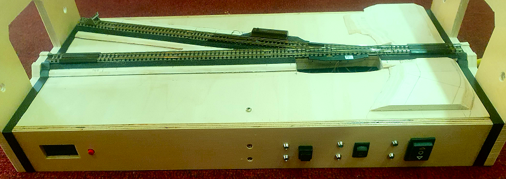

<a href="./README.md">==> English version</a>   
Letzte &Auml;nderung: 21.3.2024    
<h1>ESP32: Steuerung eines N-Spur-DCC-Moduls</h1>   

# &Uuml;bersicht
Dieses Repository enth&auml;
lt ein Programm f&uuml;
r einen EPS32, mit dem man ein N-Spur-DCC-Modul ansteuern kann, das ein Display, eine Weiche, einen Entkuppler und ein abschaltbares Gleis enth&auml;
lt.   
   
_Bild 1: N-Spur-DCC-Modul "Abstellgleis"_ 

Weiters sind in diesem Repository Programme enthalten, mit denen man einzelne Schaltungen testen kann, die f&uuml;
r die Gesamtsteuerung erforderlich sind. Jedes Programm enth&auml;
lt eine `README.md`-Datei, die dieses Programm genauer beschreibt.   

# Steuerung des N-Spur-DCC-Moduls
Die Steuerung des N-Spur-Moduls kann auf drei Arten erfolgen:
* Direkte Steuerung &uuml;
ber die Bedienelemente an der Vorderfront   
* Steuerung &uuml;
ber DCC-Kommandos   
* Steuerung &uuml;
ber WLAN mittels MQTT-Befehlen   

[Zum Seitenanfang](#up)
